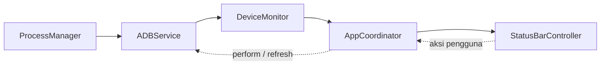

<div align="center">


# ADB Monitor

**Pantau device Android yang terhubung lewat ADB langsung dari menu bar macOS.**

</div>

ADB Monitor adalah aplikasi menu bar macOS (AppKit murni, tanpa ikon Dock) yang menjalankan `adb devices -l` secara berkala dan menampilkan hasilnya secara real-time: berapa device yang terhubung, apa modelnya, dan bagaimana statusnya. Dari menu yang sama Anda bisa menyalin serial device, me-restart, atau mematikannya.

- [Fitur](#fitur)
- [Persyaratan](#persyaratan)
- [Instalasi](#instalasi)
- [Cara pakai](#cara-pakai)
- [Preferences](#preferences)
- [Status device](#status-device)
- [Penanganan error](#penanganan-error)
- [Arsitektur](#arsitektur)
- [Pengembangan](#pengembangan)
- [Pemecahan masalah](#pemecahan-masalah)
- [Keterbatasan](#keterbatasan)
- [Privasi dan keamanan](#privasi-dan-keamanan)

## Fitur

- **Ikon menu bar dengan jumlah device**, misalnya ikon dokumen ADB diikuti `2`.
- **Daftar device** berisi nama model, serial, dan status koneksi, dengan titik berwarna (hijau, oranye, merah, abu-abu).
- **Submenu detail per device**: status, serial, tipe koneksi (USB, Wi-Fi, Emulator), model, product, nama device, dan transport ID.
- **Salin serial** dengan satu klik.
- **Restart dan Shut Down device** dengan dialog konfirmasi, dikirim hanya ke device yang dipilih (`adb -s <serial>`).
- **Auto-refresh**: menu diperbarui sendiri saat device dicolok atau dicabut, bahkan ketika menu sedang terbuka.
- **Penanganan error** jika ADB belum terpasang, path kustom salah, `adb` error, atau tidak merespons.
- **Preferences**: path ADB kustom dan interval refresh (1–60 detik, bawaan 3 detik).
- **Dark mode dan light mode** otomatis (ikon menu bar berupa template image).
- **Ringan**: tidak ada polling yang menumpuk, tidak ada proses `adb` yang tertinggal, dan seluruh kode lolos pengecekan strict concurrency Swift 6.

## Persyaratan

| Kebutuhan | Keterangan |
|---|---|
| macOS | 12.0 (Monterey) atau lebih baru |
| ADB | `adb` dari Android platform-tools, terpasang di mesin Anda |
| Xcode | Untuk membangun dari source. Proyek dibuat dengan Xcode 27 (format proyek `objectVersion 110`) |
| Device Android | USB debugging aktif; saat pertama terhubung, izinkan komputer ini di perangkat |

Memasang ADB lewat Homebrew:

```sh
brew install --cask android-platform-tools
```

## Instalasi

Belum ada rilis biner. Bangun dari source:

```sh
git clone https://github.com/nasiosheva/ADB-Monitor.git
cd ADB-Monitor
git checkout development

xcodebuild -project ADBMonitor.xcodeproj \
           -scheme ADBMonitor \
           -configuration Release \
           -derivedDataPath build \
           build

open build/Build/Products/Release/ADBMonitor.app
```

Atau buka `ADBMonitor.xcodeproj` di Xcode dan tekan **⌘R**.

Agar tersedia seperti aplikasi biasa, salin `ADBMonitor.app` ke `/Applications`. Untuk membukanya otomatis saat login, tambahkan lewat **System Settings → General → Login Items**. Fitur "launch at login" bawaan belum ada.

> **Catatan:** aplikasi ditandatangani dengan "Sign to Run Locally" (ad hoc) dan belum dinotarisasi. Di Mac lain, Gatekeeper akan memperingatkan; buka lewat klik kanan → **Open**.

## Cara pakai

Setelah dijalankan, ikon muncul di menu bar dengan angka jumlah device. Klik untuk membuka menu:

```
Android Devices (2)
─────────────────────────────
● Pixel 3a (94GAY0NRYY) — Connected      ▸
● SM A107F (R9CN4057BXJ) — Connected     ▸
─────────────────────────────
Refresh                              ⌘R
Preferences…                         ⌘,
─────────────────────────────
Quit ADB Monitor                     ⌘Q
```

Arahkan kursor ke sebuah device untuk membuka submenunya:

```
Status: Connected
Serial: 94GAY0NRYY
Connection: USB
Model: Pixel 3a
Product: sargo
Device: sargo
Transport ID: 2
─────────────────────────────
Copy Serial Number
Restart Device…
Shut Down Device…
```

### Restart dan Shut Down

Keduanya selalu meminta konfirmasi sebelum dijalankan.

| Aksi | Perintah | Tersedia untuk |
|---|---|---|
| Restart | `adb -s <serial> reboot` | Connected, Recovery |
| Shut Down | `adb -s <serial> shell reboot -p` | Connected |

Menu yang tidak tersedia untuk status device tertentu tampil abu-abu. Setelah shutdown, device **tidak bisa dinyalakan lagi dari Mac**. Perintah mati daya lewat shell (`reboot -p`) bisa ditolak oleh sebagian vendor atau ROM; jika gagal, pesan error dari `adb` ditampilkan dalam dialog.

### Pintasan keyboard

Berlaku saat menu terbuka.

| Pintasan | Aksi |
|---|---|
| ⌘R | Refresh segera |
| ⌘, | Buka Preferences |
| ⌘Q | Keluar |

## Preferences

Buka lewat **Preferences…** di menu (⌘,).

| Pengaturan | Keterangan |
|---|---|
| **ADB path** | Kosongkan untuk deteksi otomatis. Isi untuk memakai binary tertentu. Tombol **Choose…** membuka pemilih file. Label di bawah kolom menunjukkan path yang akan dipakai atau pesan kesalahan. |
| **Refresh interval** | Jeda antar polling, 1–60 detik (bawaan 3). |

Perubahan berlaku seketika setelah **Save**: aplikasi langsung melakukan refresh dengan pengaturan baru.

### Urutan deteksi ADB otomatis

Aplikasi GUI tidak mewarisi `PATH` dari shell Anda, jadi `adb` dicari di beberapa lokasi, berurutan:

1. Setiap direktori pada `PATH` milik proses
2. `/opt/homebrew/bin/adb`, `/usr/local/bin/adb`, `/usr/bin/adb`
3. `$ANDROID_HOME/platform-tools/adb` dan `$ANDROID_SDK_ROOT/platform-tools/adb`
4. `~/Library/Android/sdk/platform-tools/adb`

Jika **ADB path** kustom diisi tetapi tidak valid, aplikasi **tidak** diam-diam beralih ke deteksi otomatis. Menu menampilkan "ADB not found at custom path" agar kesalahannya terlihat.

Pengaturan disimpan di `UserDefaults` (kunci `adbPath` dan `refreshInterval`).

## Status device

| Titik | Status ADB | Arti |
|---|---|---|
| 🟢 | `device` | Terhubung normal |
| 🟠 | `unauthorized`, `no permissions`, `authorizing`, `connecting` | Perlu tindakan atau sedang menyambung |
| 🔴 | `offline` | Terdaftar tetapi tidak merespons |
| ⚪ | `recovery`, `sideload`, `bootloader`, lainnya | Mode khusus |

Beberapa status menampilkan petunjuk di submenu, misalnya "Accept the USB debugging prompt on the device." untuk `unauthorized`.

Tipe koneksi ditentukan dari serial: `emulator-*` adalah Emulator, serial berisi `:` atau `._adb-tls-` adalah Wi-Fi, selainnya USB bila ada path USB.

## Penanganan error

Ikon berubah menjadi tanda peringatan dengan teks `ADB`, dan menu menjelaskan masalahnya:

| Situasi | Yang ditampilkan |
|---|---|
| ADB tidak ditemukan | "ADB is not installed" beserta petunjuk instalasi |
| Path kustom salah | "ADB not found at custom path" dan path-nya |
| `adb` keluar dengan error | Baris pertama `stderr`, atau kode keluar jika kosong |
| `adb` tidak merespons | "adb did not respond (timed out)" (batas 10 detik untuk daftar device, 15 detik untuk restart/shutdown) |

Setelah masalahnya diperbaiki (misalnya Anda memasang ADB), menu pulih sendiri pada polling berikutnya.

## Arsitektur

Aplikasi dibangun dengan prinsip SOLID dan dependency injection manual. Semua kolaborator dipakai lewat protokol kecil, dan hanya `AppDelegate` (composition root) yang mengenal tipe konkret.



### Struktur folder

```
ADBMonitor/
├── App/            AppDelegate (entry point + composition root), AppCoordinator, MainMenuBuilder
├── Models/         ADBDevice, ADBStatus, ADBError, PowerAction
├── Services/       ADBService, ADBLocator, DeviceListParser, DeviceMonitor, Scheduler
├── Preferences/    Protokol preferensi, UserDefaultsPreferences
├── UI/             StatusBarController, StatusMenuBuilder, StatusButtonPresenter,
│                   AlertPresenter, PreferencesWindowController, DeviceStateStyle
├── Utils/          ProcessManager (+ ProcessSupport), UncheckedSendable, helper Foundation
└── Assets.xcassets/  AppIcon, MenuBarIcon
```

| Komponen | Tanggung jawab |
|---|---|
| `ProcessManager` | Menjalankan command di background queue dengan timeout; pipe dibaca asynchronous agar output besar tidak deadlock |
| `ADBService` | Fasad command ADB: menentukan lokasi binary, menjalankan command, menerjemahkan hasil ke model domain |
| `DeviceListParser` | Mem-parse output `adb devices -l` |
| `DeviceMonitor` | Polling berkala dan melaporkan perubahan status |
| `AppCoordinator` | Menghubungkan monitor, status bar, dan aksi pengguna |
| `StatusBarController` / `StatusMenuBuilder` | Memiliki `NSStatusItem` dan membangun dropdown `NSMenu` |

### Keputusan desain yang penting

- **Polling tidak pernah tumpang tindih.** `DeviceMonitor` menjadwalkan poll berikutnya *setelah* poll sebelumnya selesai (timer sekali pakai, bukan interval tetap). Refresh manual saat poll berjalan hanya menandai satu putaran tambahan.
- **Timer tetap jalan saat menu terbuka.** Timer didaftarkan di mode run loop `.common`, sehingga daftar device terus diperbarui ketika menu sedang ditampilkan.
- **Hanya perubahan yang memperbarui UI.** `onStatusChange` dipanggil jika status berbeda dari poll sebelumnya, jadi tidak ada kedipan menu.
- **Menu diisi ulang di tempat.** `NSMenu` yang sama dikosongkan dan diisi lagi, bukan diganti, agar menu yang sedang terbuka tidak menutup.
- **Tidak ada proses `adb` yang menggantung.** Setelah proses keluar, aplikasi menunggu EOF pipe maksimal 1 detik dengan satu batas bersama untuk stdout dan stderr, karena `adb` bisa meninggalkan daemon child yang masih memegang ujung pipe.
- **Tanpa retain cycle.** Closure memakai referensi `weak`, dan `Process` serta collector pipe dibuat per-eksekusi lalu dilepas.
- **Isolasi concurrency yang jelas.** Kode UI, `DeviceMonitor`, dan `AppCoordinator` bertanda `@MainActor`. Kode lintas-thread (`ProcessManager`) ditandai `@unchecked Sendable` dengan alasan di komentar. Hasilnya bersih pada `-strict-concurrency=complete` (Swift 5) maupun mode bahasa Swift 6.
- **Entry point eksplisit.** `AppDelegate` ber-`@main` dengan `static func main()` sendiri, karena `@main` saja memanggil `NSApplicationMain` yang hanya membuat delegate jika ada nib, dan proyek ini tidak memakai nib.

### Menambah aksi daya baru

`PowerAction` adalah `CaseIterable`: item menu, dialog konfirmasi, argumen adb, dan ketersediaan per status semuanya diturunkan dari enum itu. Menambah aksi (misalnya reboot ke recovery) cukup dengan menambah satu `case`, tanpa menyentuh `StatusMenuBuilder` atau `AlertPresenter`.

## Pengembangan

### Build

```sh
xcodebuild -project ADBMonitor.xcodeproj -scheme ADBMonitor -configuration Debug build
```

Proyek memakai `PBXFileSystemSynchronizedRootGroup`, jadi file Swift baru di folder `ADBMonitor/` otomatis masuk target tanpa mengedit `project.pbxproj`.

### Konfigurasi build yang perlu diketahui

| Pengaturan | Nilai | Alasan |
|---|---|---|
| `MACOSX_DEPLOYMENT_TARGET` | `12.0` | Xcode 27 tidak lagi mendukung target di bawah 12.0 |
| `ENABLE_APP_SANDBOX` | `NO` | Sandbox memblokir peluncuran `adb`. Konsekuensinya aplikasi tidak bisa dirilis lewat Mac App Store |
| `INFOPLIST_KEY_LSUIElement` | `YES` | Aplikasi menu bar tanpa ikon Dock |
| `SWIFT_VERSION` | `5.0` | Kode juga diuji lolos sebagai Swift 6 |

### Pengujian

Belum ada test target di proyek. Namun semua kode di `Models/`, `Services/`, `Preferences/`, dan `Utils/` tidak bergantung pada AppKit, dan semua dependensinya berupa protokol (`ProcessRunning`, `ADBLocating`, `DeviceListParsing`, `ADBServicing`, `Scheduling`, dst.), sehingga mudah diuji dengan fake tanpa device sungguhan. Misalnya `DeviceMonitor` bisa diuji dengan `Scheduling` palsu yang dijalankan manual.

`DeviceMonitor` adalah `@MainActor`; pada harness uji berbasis `swiftc`, bungkus pemakaiannya dengan `MainActor.assumeIsolated { ... }`.

### Lint dan pengecekan concurrency

Gaya kode: indentasi 4 spasi, lebar maksimum 120 karakter. Cek tambahan dengan compiler dalam mode ketat, keduanya harus bersih:

```sh
cd ADBMonitor && SDK=$(xcrun --show-sdk-path)
FILES="App/*.swift Models/*.swift Services/*.swift Preferences/*.swift UI/*.swift Utils/*.swift"

swiftc -typecheck -parse-as-library -sdk $SDK -target arm64-apple-macos12.0 \
       -swift-version 5 -strict-concurrency=complete $FILES
swiftc -typecheck -parse-as-library -sdk $SDK -target arm64-apple-macos12.0 \
       -swift-version 6 $FILES
```

`xcrun swift-format lint --recursive .` juga bisa dipakai. Catatan `Indentation`/`AddLines` darinya sengaja diabaikan karena kode memakai perataan parameter gaya Xcode.

### Format output `adb` yang ditangani parser

`adb` versi berbeda menulis output sedikit berbeda, dan parser menangani keduanya:

```
R58M123ABC     device usb:1-1 product:o1sxxx model:SM_G991B device:o1s transport_id:2
R9CN4057BXJ    device 2-1 product:a10sxx model:SM_A107F device:a10s transport_id:1
0123456789     no permissions (user in plugdev group; are your udev rules wrong?); see [url]
```

Path USB bisa bertulis `usb:1-1` atau `2-1` tanpa prefix, dan status `no permissions` terdiri dari dua kata. Baris pesan daemon (diawali `*`) diabaikan.

## Pemecahan masalah

**Ikon tidak muncul di menu bar.**
Jika menu bar penuh, macOS bisa menyembunyikan item yang paling kiri. Tutup aplikasi menu bar lain atau perlebar ruang. Pastikan juga hanya satu instance yang berjalan.

**Menu menampilkan "ADB is not installed" padahal sudah terpasang.**
Aplikasi GUI tidak membaca `PATH` dari `~/.zshrc`. Cek lokasi `adb` dengan `which adb`, lalu isi path itu di **Preferences → ADB path**.

**Device tampil sebagai Unauthorized.**
Buka layar perangkat dan setujui prompt "Allow USB debugging". Jika tidak muncul, cabut dan colok ulang kabel, atau di perangkat pilih *Revoke USB debugging authorizations* lalu coba lagi.

**Device tampil sebagai Offline.**
Colok ulang device, atau restart server adb dengan `adb kill-server && adb start-server`.

**Pesan "adb server version doesn't match this client".**
Ada dua versi `adb` yang berbeda berjalan bersamaan. Jalankan `adb kill-server`, lalu pastikan aplikasi memakai `adb` yang sama dengan yang Anda pakai di terminal (atur lewat Preferences).

**Restart berhasil tetapi Shut Down gagal.**
Sebagian vendor atau ROM menolak `reboot -p` dari shell tanpa root. Pesan error ditampilkan dalam dialog; matikan device secara manual dari perangkat.

**Device wireless tidak terdeteksi.**
Hubungkan dulu di terminal, misalnya `adb connect 192.168.1.5:5555` atau `adb pair`. ADB Monitor menampilkan apa yang dilaporkan `adb devices -l`; ia tidak melakukan koneksi sendiri.

## Keterbatasan

- Belum ada rilis biner, notarisasi, atau auto-update.
- Tidak bisa didistribusikan lewat Mac App Store karena App Sandbox dimatikan.
- Tidak ada fitur "launch at login" bawaan.
- Tidak ada notifikasi saat device terhubung atau terlepas; hanya ikon dan menu yang diperbarui.
- Hanya Restart dan Shut Down. Reboot ke recovery atau bootloader belum ada (mudah ditambahkan, lihat [Menambah aksi daya baru](#menambah-aksi-daya-baru)).
- Belum ada test target di proyek Xcode.
- Teks antarmuka masih dalam bahasa Inggris.

## Privasi dan keamanan

- Aplikasi tidak melakukan koneksi jaringan sendiri dan tidak mengirim telemetri. Satu-satunya hal yang dilakukannya adalah menjalankan `adb` lokal.
- Pengaturan disimpan lokal di `UserDefaults`.
- Karena tidak ber-sandbox, aplikasi bisa menjalankan binary apa pun yang Anda tunjuk di **ADB path**. Isi hanya dengan `adb` yang Anda percaya.
- Restart dan Shut Down mengirim perintah ke device sungguhan; keduanya selalu meminta konfirmasi dahulu.

## Lisensi

Belum ditentukan. Selama belum ada berkas lisensi, semua hak dimiliki penulis.
