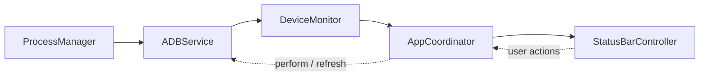

<div align="center">


# ADB Monitor

**Monitor Android devices connected over ADB from the macOS menu bar.**

</div>

ADB Monitor is a macOS menu bar app (pure AppKit, no Dock icon). It runs `adb devices -l` on a timer and shows the result in real time: how many devices are connected, their models, and their connection states. From the same menu you can copy a device serial, restart a device, or shut it down.

- [Features](#features)
- [Requirements](#requirements)
- [Installation](#installation)
- [Usage](#usage)
- [Wi-Fi debugging](#wi-fi-debugging)
- [Preferences](#preferences)
- [Languages](#languages)
- [Device states](#device-states)
- [Error handling](#error-handling)
- [Architecture](#architecture)
- [Development](#development)
- [Troubleshooting](#troubleshooting)
- [Limitations](#limitations)
- [Privacy and security](#privacy-and-security)
- [License](#license)

## Features

- **Menu bar icon with a device count**, for example the ADB document icon followed by `2`.
- **Device list** with model name, serial, and connection state, marked with a colored dot (green, orange, red, gray).
- **Per-device detail submenu**: state, serial, connection type (USB, Wi-Fi, Emulator), model, product, device name, and transport ID.
- **Copy** the serial, an `adb -s <serial>` command prefix, all device details as text (for a bug report), or (for a Wi-Fi device) its `host:port` address with one click.
- **Take Screenshot** of a device screen into a PNG on your Desktop.
- **Record Screen** to a small MP4 (about 480p, at most 5 minutes) with [`scrcpy`](https://github.com/Genymobile/scrcpy), with a Stop button.
- **Mirror Screen** with [`scrcpy`](https://github.com/Genymobile/scrcpy), when it is installed.
- **Notifications** when a device connects or disconnects (optional, off by default).
- **Android version and battery level** in the device submenu, read once per device and refreshed at most every 60 seconds.
- **Fastboot devices**: phones in bootloader mode are listed in their own section (needs `fastboot`), with copy serial and a reboot action.
- **Reboot to Recovery, Bootloader, or Download Mode** from the device submenu.
- **Restart ADB Server** from the main menu.
- **Open Developer Options** on the device screen from the device submenu.
- **Wi-Fi debugging** (see [Wi-Fi debugging](#wi-fi-debugging)): detects devices on your network, connects, pairs (Android 11+), disconnects, and switches a USB device to Wi-Fi.
- **Restart and Shut Down** (and the reboot modes) with a confirmation dialog. Commands go only to the selected device (`adb -s <serial>`).
- **Auto-refresh**: the menu updates when a device is plugged in or unplugged, even while the menu is open.
- **Error handling** for a missing ADB install, a bad custom path, `adb` errors, and `adb` timeouts.
- **Preferences**: custom ADB path, refresh interval (1–60 seconds, default 3), language, and launch at login.
- **Five languages**: English, Bahasa Indonesia, Chinese (Traditional), Cantonese, and Batak Toba, switchable at runtime without a restart (see [Languages](#languages)).
- **Launch at login** (macOS 13 and later) from the Preferences window.
- **Dark and light mode** supported automatically (the menu bar icon is a template image).
- **Lightweight**: polls never overlap, no `adb` processes are left behind, and the code passes Swift 6 strict concurrency checking.

## Requirements

| Requirement | Details |
|---|---|
| macOS | 12.0 (Monterey) or later |
| ADB | `adb` from Android platform-tools, installed on your machine |
| Xcode | Needed to build from source. The project was created with Xcode 27 (project format `objectVersion 110`) |
| Android device | USB debugging enabled. On the first connection, allow this computer on the device |

Install ADB with Homebrew:

```sh
brew install --cask android-platform-tools
```

## Installation

There is no binary release yet. Build from source:

```sh
git clone https://github.com/nasiosheva/ADB-Monitor.git
cd ADB-Monitor
git checkout development

xcodebuild -project ADBMonitor.xcodeproj \
           -scheme ADBMonitor \
           -configuration Release \
           -derivedDataPath build \
           build

open build/Build/Products/Release/ADBMonitor.app
```

Or open `ADBMonitor.xcodeproj` in Xcode and press **⌘R**.

To use it like a normal app, copy `ADBMonitor.app` to `/Applications`. To start it at login, turn on **Launch at login** in Preferences (macOS 13 and later), or on macOS 12 add it under **System Settings → General → Login Items**. Register it from the copy in `/Applications`, not from a build folder.

> **Note:** the app is signed with "Sign to Run Locally" (ad hoc) and is not notarized. On another Mac, Gatekeeper will warn. Open it with right-click → **Open**.

## Usage

After launch, the icon appears in the menu bar with the number of connected devices. Click it to open the menu:

```
Android Devices (2)
─────────────────────────────
● Pixel 3a (94GAY0NRYY) — Connected      ▸
● SM A107F (R9CN4057BXJ) — Connected     ▸
─────────────────────────────
Refresh                              ⌘R
Preferences…                         ⌘,
Restart ADB Server…
─────────────────────────────
Quit ADB Monitor                     ⌘Q
```

A phone that is in bootloader (fastboot) mode does not appear in `adb devices`, so it gets its own section when `fastboot devices` finds it:

```
Fastboot Devices (1)
● ZY22XXXXXX — Fastboot                  ▸     Status, Serial, Copy Serial Number, Reboot Device…
```

Hover over a device to open its submenu:

```
Status: Connected
Serial: 94GAY0NRYY
Connection: USB
Model: Pixel 3a
Product: sargo
Device: sargo
Transport ID: 2
Android version: 12
Battery: 87%
─────────────────────────────
Copy Serial Number
Copy ADB Command Prefix
Copy Device Info
Switch to Wi-Fi
Open Developer Options
Take Screenshot
Record Screen (480p)
Mirror Screen (scrcpy)
Restart Device…
Shut Down Device…
─────────────────────────────
Reboot to Recovery…
Reboot to Bootloader…
Reboot to Download Mode…
```

"Android version" and "Battery" appear a moment after the device is first seen. They are read with one shell command (`getprop ro.build.version.release; dumpsys battery`), only for devices in the Connected state, and not more often than every 60 seconds. If a device does not answer, the rows are simply left out. "Copy Address" is added for a Wi-Fi device whose serial is a plain `host:port`.

### Open Developer Options

Runs `adb -s <serial> shell am start -a android.settings.APPLICATION_DEVELOPMENT_SETTINGS`, which opens the Developer options screen on the phone. It needs no confirmation, is available for devices in the Connected state (USB or Wi-Fi), and does not change anything on the device. If the phone has no matching screen, the error from Android is shown in a dialog.

### Restart, Shut Down, and reboot modes

All of these always ask for confirmation before they run.

| Action | Command | Available for |
|---|---|---|
| Restart | `adb -s <serial> reboot` | Connected, Recovery |
| Shut Down | `adb -s <serial> shell reboot -p` | Connected |
| Reboot to Recovery | `adb -s <serial> reboot recovery` | Connected, Recovery |
| Reboot to Bootloader | `adb -s <serial> reboot bootloader` | Connected, Recovery |
| Reboot to Download Mode | `adb -s <serial> reboot download` | Connected |

A menu item is grayed out when the action is not available for the device's current state. Download Mode is a Samsung feature (the screen Odin and Heimdall use); other vendors ignore or reject it, and then the error from `adb` is shown. After a shutdown, the device **cannot be powered back on from the Mac**. Some vendors and ROMs reject the shell power-off command (`reboot -p`). If it fails, the error message from `adb` is shown in a dialog.

### Take Screenshot

Runs `adb -s <serial> shell screencap -p`, pulls the PNG to your **Desktop** as `ADB Screenshot <model> 2026-10-04 at 18.30.12.png`, removes the temporary file from the device, and shows the file in Finder. It needs no confirmation and is available for devices in the Connected state. A second click on the same device while a screenshot is running is ignored. The first time, macOS asks whether ADB Monitor may access your Desktop folder. Apps that block screen capture (some banking and video apps) give a black image; that is Android's choice, not an error.

### Record Screen

Runs `scrcpy` in recording mode, with no window and no audio on the Mac:

```
scrcpy -s <serial> --record=<file>.mp4 --record-format=mp4 --max-size=854 --video-bit-rate=1M --max-fps=24 --time-limit=300 --no-audio --no-playback
```

| Setting | Value | Why |
|---|---|---|
| Container and codec | MP4, H.264 | Plays on macOS, Windows, Android, iPhone, and in browsers |
| Size | longest side 854 px, aspect ratio kept | "480p" for a phone held upright is 480 × 854. (`--max-size=480` would limit the *longest* side and give a tiny 222 × 480 picture on a tall phone.) |
| Bitrate and frame rate | 1 Mbps, 24 fps | Small file: roughly 7 MB per minute, about 37 MB for the full 5 minutes (an estimate, it depends on what is on screen) |
| Length | at most 300 s | `scrcpy` stops by itself and closes the file |

The menu item changes to **Stop Recording** while a device is being recorded. Stopping sends `scrcpy` the same signal as Ctrl+C (SIGINT), which lets it finish the file; if it has not exited after 5 seconds it is terminated. When the recording ends, for any reason, the file `ADB Recording <model> <date> at <time>.mp4` is shown in Finder on your Desktop. Several devices can be recorded at the same time. If you quit ADB Monitor during a recording, `scrcpy` keeps running and finishes the file when it reaches the time limit. A recording of a screen that does not change can be shorter than the time that passed, because Android only produces a frame when something changes. As with screenshots, apps that block screen capture give a black picture, and the profile (size, bitrate, frame rate, limit) is one struct in the code, not a setting.

### Mirror Screen

Starts `scrcpy -s <serial>`, which opens its own window. `scrcpy` is found like `adb` (`PATH`, Homebrew, and so on); install it with `brew install scrcpy`. The app passes the `adb` it uses to `scrcpy` through the `ADB` environment variable, so a custom ADB path in Preferences is respected. If `scrcpy` quits within the first three seconds, its `ERROR` lines are shown in a dialog. A device that already has a mirror window is not started a second time. Closing the window ends `scrcpy`; quitting ADB Monitor leaves open windows alone.

### Copy Device Info

Copies the rows of the detail submenu as plain text, in the language of the menu:

```
Status: Connected
Serial: 94GAY0NRYY
Connection: USB
Model: Pixel 3a
Android version: 12
Battery: 87%
```

### Notifications

Turn on **Notify when a device connects or disconnects** in Preferences. macOS asks for permission the first time. The notification names the device, for example "Device connected — Pixel 3a (94GAY0NRYY)". Devices that are already connected when the app starts, or when you turn the setting on, are not announced. A device must be missing from two polls in a row before it counts as disconnected, so an adb server restart or a flaky Wi-Fi link does not produce a false "disconnected" and "connected" pair. A change of state alone (for example Unauthorized → Connected) is not announced.

### Restart ADB Server

Runs `adb kill-server` and then `adb start-server`, after a confirmation. It is shown when `adb` is installed. The adb server is shared with every other tool on your Mac (Android Studio, `scrcpy`, a terminal), and they are disconnected for a moment, which is why the confirmation says so. It also helps when Wi-Fi connects fail with "No route to host" because the running server was started by a program without macOS Local Network permission.

### Fastboot devices

The list comes from `fastboot devices`, in the same poll as `adb devices`. `fastboot` is found the same way as `adb` (`PATH`, Homebrew, the Android SDK `platform-tools`); the custom ADB path in Preferences does not apply to it. If `fastboot` is not installed, or finds nothing, the section is just absent and no error is shown. **Reboot Device…** (after a confirmation) runs `fastboot -s <serial> reboot`.

### Keyboard shortcuts

These work while the menu is open.

| Shortcut | Action |
|---|---|
| ⌘R | Refresh now |
| ⌘, | Open Preferences |
| ⌘Q | Quit |

## Wi-Fi debugging

ADB Monitor shows devices that are already connected over Wi-Fi (marked "Wi-Fi") and can set up new connections.

| Menu item | What it does | adb command |
|---|---|---|
| **Available over Wi-Fi (n)** | Devices found on the network that are not connected yet. Click one to connect | `adb mdns services`, `adb connect` |
| **Pair with …** | A device that is waiting for a pairing code. Opens the pairing dialog with the address filled in | `adb pair` |
| **Connect to IP Address…** | Type `host` or `host:port` (default port 5555) | `adb connect` |
| **Pair Device…** | Type the pairing address and the 6-digit code | `adb pair` |
| Device submenu → **Disconnect** | For devices connected over Wi-Fi | `adb disconnect <serial>` |
| Device submenu → **Switch to Wi-Fi** | For a ready device connected by USB | `adb tcpip 5555`, then `adb connect` |

**Android 11 and later (Wireless debugging):**

1. On the phone open Developer options → Wireless debugging and turn it on.
2. Choose **Pair device with pairing code**. The phone shows an address (IP and port) and a 6-digit code.
3. In ADB Monitor choose **Pair with …** if the phone is listed, or **Pair Device…** and type the address and code.
4. After pairing, the phone shows up under **Available over Wi-Fi**. Click it to connect.

**Any Android version, with a USB cable:** plug the phone in and choose **Switch to Wi-Fi** in its submenu. The app reads the phone's Wi-Fi IP address, runs `adb tcpip 5555`, and connects with a few retries while `adbd` restarts. You can then unplug the cable. The phone stays in TCP mode until it is rebooted.

Notes:

- The phone and the Mac must be on the same network. Guest and office networks often isolate devices or block mDNS. Discovery then finds nothing, but **Connect to IP Address…** still works if you know the address.
- The Wireless debugging port changes every time you turn it on, and pairing codes expire quickly.
- IPv6 addresses are not supported; use the IPv4 address.
- macOS may ask for **Local Network** access the first time devices are discovered or connected. Allow it, or Wi-Fi connections can fail with "No route to host".
- `adb connect` and `adb tcpip` are not encrypted. Only use them on networks you trust. Pairing (Android 11+) uses TLS.
- Discovery runs on every poll. Turn it off with **Detect devices on Wi-Fi** in Preferences if you do not need it.

## Preferences

Open it from **Preferences…** in the menu (⌘,).

| Setting | Details |
|---|---|
| **ADB path** | Leave empty for auto-detection. Set it to use a specific binary. **Choose…** opens a file picker. The label under the field shows the path that will be used, or an error message. |
| **Refresh interval** | Delay between polls, 1–60 seconds (default 3). |
| **Language** | **System default** or one of the five languages. Applied on **Save**; the menu and dialogs switch immediately, with no restart. |
| **Detect devices on Wi-Fi** | Looks for devices on the network with mDNS on every poll (default on). Manual connect and pair are always available. |
| **Notifications** | Notify when a device connects or disconnects (default off). macOS asks for permission when you save with this on. |
| **Launch at login** | Registers the app as a login item (macOS 13+). On macOS 12 the checkbox is disabled with a hint. If macOS asks for approval, the hint points to **System Settings → General → Login Items**. |

Changes take effect right after **Save**: the app refreshes immediately with the new settings.

### ADB auto-detection order

GUI apps do not inherit the `PATH` from your shell, so `adb` is searched for in several places, in this order:

1. Every directory in the process `PATH`
2. `/opt/homebrew/bin/adb`, `/usr/local/bin/adb`, `/usr/bin/adb`
3. `$ANDROID_HOME/platform-tools/adb` and `$ANDROID_SDK_ROOT/platform-tools/adb`
4. `~/Library/Android/sdk/platform-tools/adb`

If you set a custom **ADB path** and it is invalid, the app does **not** silently fall back to auto-detection. The menu shows "ADB not found at custom path" so the mistake is visible.

Settings are stored in `UserDefaults` (keys `adbPath`, `refreshInterval`, `language`, and `wirelessDiscovery`). The launch-at-login state is not stored by the app: it is always read from macOS, because you can also change it in System Settings.

## Languages

| Language | Code | Notes |
|---|---|---|
| English | `en` | Reference language and fallback |
| Bahasa Indonesia | `id` | |
| Chinese (Traditional) | `zh-Hant` | Taiwan-style wording (偏好設定, 結束, 拷貝) |
| Cantonese | `yue` | Written colloquial Cantonese in Traditional characters (嘅, 咗, 唔, 冇, 喺) |
| Batak Toba | `bbc` | Technical terms use Indonesian loanwords |

With **System default**, the app picks the first supported language in your macOS language list and falls back to English. Any Chinese variant maps to Traditional Chinese, and only `yue` maps to Cantonese.

> **Translation quality:** all translations were written with AI assistance and have **not** been reviewed by native speakers. Cantonese and Batak Toba are the least certain and are marked as drafts in the source. Corrections are welcome: each language is one file under `ADBMonitor/Localization/`.

Text that comes straight from `adb` (for example the first line of its error output) is shown as-is and is not translated.

## Device states

| Dot | ADB state | Meaning |
|---|---|---|
| 🟢 | `device` | Connected normally |
| 🟠 | `unauthorized`, `no permissions`, `authorizing`, `connecting` | Needs action, or still connecting |
| 🔴 | `offline` | Listed but not responding |
| ⚪ | `recovery`, `sideload`, `bootloader`, others | Special mode |

Some states show a hint in the submenu, for example "Accept the USB debugging prompt on the device." for `unauthorized`.

The connection type is derived from the serial: `emulator-*` is Emulator, a serial that contains `:` or `._adb-tls-` is Wi-Fi, and anything else is USB when a USB path is present.

## Error handling

The icon changes to a warning symbol with the text `ADB`, and the menu explains the problem:

| Situation | What is shown |
|---|---|
| ADB not found | "ADB is not installed" with install instructions |
| Bad custom path | "ADB not found at custom path" and the path |
| `adb` exits with an error | The first line of `stderr`, or the exit code if `stderr` is empty |
| `adb` does not respond | "adb did not respond (timed out)" (10-second limit for the device list, 15 seconds for restart and shut down) |

After the problem is fixed (for example, you install ADB), the menu recovers on the next poll.

## Architecture

The app follows SOLID principles with manual dependency injection. Collaborators are small protocols, and only `AppDelegate` (the composition root) knows the concrete types.



### Folder structure

```
ADBMonitor/
├── App/            AppDelegate (entry point + composition root), AppCoordinator, WirelessCoordinator, ToolsCoordinator,
│                   ScreenCoordinator, MainMenuBuilder
├── Models/         ADBDevice, ADBStatus, ADBError, PowerAction, WirelessService, WirelessAddress, DeviceDetails,
│                   FastbootDevice, DeviceChange
├── Services/       ADBService (+ Wireless, Details, Server), FastbootService, ADBLocator, DeviceListParser,
│                   WirelessServiceParser, WiFiAddressParser, DeviceDetailsParser, FastbootDeviceParser,
│                   DeviceDetailsTracker, DeviceChangeDetector, DeviceChangeNotifier, ScrcpyMirror, ScrcpyRecorder, DeviceMonitor, WirelessSwitcher, Scheduler, LaunchAtLogin
├── Localization/   AppLanguage, L10nKey, Localizer, one Translations+<Language>.swift per language
├── Preferences/    Preference protocols, UserDefaultsPreferences
├── UI/             StatusBarController, StatusMenuBuilder, StatusButtonPresenter,
│                   AlertPresenter, WirelessPrompter, PreferencesWindowController, DeviceStateStyle, Clipboard, FileRevealer,
│                   UserNotificationNotifier
├── Utils/          ProcessManager, ProcessLauncher (+ ProcessSupport), UncheckedSendable, Foundation helpers
└── Assets.xcassets/  AppIcon, MenuBarIcon
```

| Component | Responsibility |
|---|---|
| `ProcessManager` | Runs commands on a background queue with a timeout. Pipes are read asynchronously so large output cannot deadlock |
| `ADBService` | ADB command facade: locates the binary, runs the command, translates the result into domain models |
| `DeviceListParser` | Parses the output of `adb devices -l` |
| `DeviceMonitor` | Polls on a timer and reports status changes |
| `AppCoordinator` | Wires the monitor, the status bar, and user actions together |
| `WirelessCoordinator` | Wi-Fi flows: validate input, run adb, refresh the list, report the result |
| `WirelessSwitcher` | USB → Wi-Fi: find the IP, `adb tcpip`, then `adb connect` with retries |
| `ToolsCoordinator` | Restart ADB server and reboot of a fastboot device: confirm, run, refresh, show an error |
| `DeviceDetailsTracker` | Reads the Android version and battery of each connected device once, then at most every 60 seconds; driven by `DeviceMonitor.onPoll` |
| `ScreenCoordinator` | Screenshot (names the file, shows it in Finder) and screen mirroring; errors are shown in a dialog |
| `ScrcpyMirror` / `ScrcpyRecorder` / `ProcessLauncher` | Start `scrcpy` for a device. The mirror reports whether it stayed up; the recorder tracks each recording until it ends and can stop it. `ProcessLauncher` runs a tool that keeps running, reports its exit, and can send it SIGINT or SIGTERM |
| `DeviceChangeDetector` / `DeviceChangeNotifier` | Find devices that came or went between polls (with a two-poll delay for disconnects) and turn them into notifications |
| `FastbootService` | Runs `fastboot devices` and `fastboot -s <serial> reboot`; found with its own `ADBLocator` |
| `StatusBarController` / `StatusMenuBuilder` | Own the `NSStatusItem` and build the `NSMenu` dropdown |
| `Localizer` | Resolves the effective language and returns text for an `L10nKey`; announces language changes |
| `LaunchAtLogin` | Reads and changes the login item through `SMAppService` (macOS 13+) behind a small protocol |

### Key design decisions

- **Polls never overlap.** `DeviceMonitor` schedules the next poll *after* the current one finishes, using a single-shot timer instead of a fixed interval. A manual refresh during a poll only flags one extra round.
- **The timer keeps running while the menu is open.** The timer is registered in the `.common` run loop mode, so the device list keeps updating while the menu is displayed.
- **Only changes update the UI.** `onStatusChange` fires only when the status differs from the previous poll, so the menu does not flicker.
- **The menu is refilled in place.** The same `NSMenu` is emptied and filled again instead of being replaced, so an open menu does not close.
- **Wi-Fi results are read from text, not exit codes.** `adb connect` exits 0 even when it fails (for example "failed to connect to … No route to host"), so success means the output starts with "connected to" or "already connected to". `adb pair` is checked for "Successfully paired".
- **`adb disconnect` is never run without a serial.** Without arguments it disconnects every device, so the service refuses an empty serial.
- **Mirroring is a long-running process, not a command.** `ProcessManager` waits for a process to end and has a timeout, which is right for `adb` but wrong for a window that stays open for hours. `ProcessLauncher` starts the process, drains its output (so it never blocks on a full pipe), keeps only the last 4 KB of its error output, and reports the exit.
- **Screenshots do not use `exec-out`.** `adb exec-out screencap -p` would avoid a temporary file on the device, but the process layer reads output as text and would corrupt the PNG bytes. The app uses `screencap -p <file>`, `pull`, `rm -f` instead.
- **Fastboot and details never block or break the device list.** `fastboot devices` runs inside the same poll (after discovery), so polls still never overlap, and its failure means an empty list. The battery and version are read by `DeviceDetailsTracker` outside the poll chain, one device at a time, and a device that cannot answer is not asked again before the interval passes.
- **Discovery never blocks the device list.** It runs after `adb devices` in the same poll, so polls still never overlap. A discovery failure just means an empty Wi-Fi list, and services that already appear as connected devices are filtered out.
- **No hanging `adb` processes.** After the process exits, the app waits for pipe EOF for at most 1 second, with one shared deadline for stdout and stderr, because `adb` can leave a daemon child that still holds the pipe.
- **No retain cycles.** Closures capture `weak` references, and `Process` and the pipe collectors are created per run and released afterwards.
- **Explicit concurrency isolation.** UI code, `DeviceMonitor`, and `AppCoordinator` are `@MainActor`. Cross-thread code (`ProcessManager`) is `@unchecked Sendable`, with the reason in a comment. The result is clean under `-strict-concurrency=complete` (Swift 5) and under the Swift 6 language mode.
- **Text lives in tables, not in code.** Models carry `L10nKey`s instead of English strings, and every user-visible string is looked up through `Localizer`. Tables are Swift dictionaries rather than `.lproj` files, so the language can change at runtime and codes such as `bbc` and `yue` need no Xcode localization setup. A missing key falls back to English.
- **Language changes propagate through notifications.** Saving preferences posts `.preferencesDidChange`; `Localizer` re-resolves the language and posts `.languageDidChange` only when it really changed; `StatusBarController` then rebuilds the menu from its last status.
- **Colored status dots are part of the title.** `NSMenuItem.image` is not drawn on current macOS, so the dot is a colored character inside an attributed title.
- **Explicit entry point.** `AppDelegate` is `@main` and defines its own `static func main()`. `@main` alone only calls `NSApplicationMain`, which creates the delegate only when a nib exists, and this project has no nib.

### Adding or changing text

1. Add a case to `L10nKey`.
2. Add the string to **every** `Translations+<Language>.swift` file, with the same placeholders (`%@`, or `%1$@` and `%2$@` when argument order differs).
3. Read it with `localizer.text(.yourKey, arguments…)`.

To add a language, add a case to `AppLanguage` (with its autonym), a `Translations+<Language>.swift` file, and a branch in `Translations.table(for:)`. The compiler enforces the `switch` statements; completeness of each table and placeholder consistency are checked by a test harness (see [Testing](#testing)).

### Adding a new power action

`PowerAction` is `CaseIterable`. The menu items, the confirmation dialog, the adb arguments, and per-state availability are all derived from it. Adding an action (the three reboot modes were added this way) means adding one `case`, its `L10nKey`s, and their translations. `StatusMenuBuilder` and `AlertPresenter` do not change.

## Development

### Build

```sh
xcodebuild -project ADBMonitor.xcodeproj -scheme ADBMonitor -configuration Debug build
```

The project uses `PBXFileSystemSynchronizedRootGroup`, so new Swift files under `ADBMonitor/` join the target automatically, without editing `project.pbxproj`.

### Build settings to know about

| Setting | Value | Reason |
|---|---|---|
| `MACOSX_DEPLOYMENT_TARGET` | `12.0` | Xcode 27 no longer supports targets below 12.0 |
| `ENABLE_APP_SANDBOX` | `NO` | The sandbox blocks launching `adb`. As a result the app cannot ship through the Mac App Store |
| `INFOPLIST_KEY_LSUIElement` | `YES` | Menu bar app with no Dock icon |
| `SWIFT_VERSION` | `5.0` | The code is also checked to compile as Swift 6 |

### Testing

The `ADBMonitorTests` target contains 460+ XCTest unit tests. Run them with **⌘U** in Xcode, or:

```sh
xcodebuild test -project ADBMonitor.xcodeproj -scheme ADBMonitor -destination 'platform=macOS'
```

Tests use fakes for every protocol boundary (`ProcessRunning`, `ADBLocating`, `ADBServicing`, `Scheduling`, `DeviceMonitoring`, `AlertPresenting`, `StatusBarRendering`, `PreferencesPresenting`), so no Android device is needed. A few tests run real processes (`/bin/sh`, `/usr/bin/yes`) to cover timeouts, large output, and child processes that inherit the pipe.

| Area | What is covered |
|---|---|
| `DeviceListParser` | Both USB path formats, `no permissions`, daemon lines, sorting, malformed input |
| `ADBLocator` | Custom path rules, no silent fallback, `PATH`, well-known paths, `ANDROID_HOME`, `ANDROID_SDK_ROOT`, home SDK, search order |
| `ADBService` | adb arguments for restart and shut down, error mapping, stderr handling |
| `DeviceMonitor` | No overlapping polls, queued refresh, change-only notifications, `stop` behavior |
| Screen tools and notifications | `DeviceChangeDetector` (baseline, two-poll disconnect, order), `DeviceChangeNotifier` (disabled/enabled, permission request), screenshot command sequence and failure cleanup, `ScrcpyMirror` (startup, early failure, duplicates, real error output), `ScrcpyRecorder` (profile arguments, stop, forced stop, end of recording), `ProcessLauncher` with real processes (including SIGINT), `ScreenCoordinator` (file names, Finder, errors), menu items |
| Tools and details | Boot-mode arguments and availability, `DeviceDetailsParser` (real Samsung output), `DeviceDetailsTracker` (interval, in-flight, failures, vanished devices), `FastbootDeviceParser`, `FastbootService`, restart-server sequence, `ToolsCoordinator` order of events, menu items and clipboard copies |
| `ProcessManager` | Output capture, 3 MB output, timeout, missing executable, inherited pipe, completion queue |
| Preferences, localization | Defaults, trimming, clamping, notifications, completeness of all five translation tables, placeholder consistency, language resolution |
| `StatusMenuBuilder` | Menu structure per status, submenu rows, power item enablement, click handling, colored dot, languages |
| `AppCoordinator` | Lifecycle, confirm → perform → refresh → error ordering, lazy preferences window |

Not covered by automated tests: `AlertPresenter` (modal dialogs), `PreferencesWindowController` (layout and the Save flow), `StatusButtonPresenter`, `MainMenuBuilder`, copying the serial to the clipboard (it would overwrite yours), and a real login item registration (it would register the build folder). Check those by looking at them.

The test host is the app itself. `AppDelegate` skips its startup when XCTest is loaded, so tests never create a menu bar item or run `adb`. The test target builds for macOS 14 because XCTest requires it; the app still targets macOS 12.

### Lint and concurrency checks

Code style: 4-space indentation, 120-column limit. Also run the compiler in strict mode. Both commands must be clean:

```sh
cd ADBMonitor && SDK=$(xcrun --show-sdk-path)
FILES="App/*.swift Localization/*.swift Models/*.swift Services/*.swift Preferences/*.swift UI/*.swift Utils/*.swift"

swiftc -typecheck -parse-as-library -sdk $SDK -target arm64-apple-macos12.0 \
       -swift-version 5 -strict-concurrency=complete $FILES
swiftc -typecheck -parse-as-library -sdk $SDK -target arm64-apple-macos12.0 \
       -swift-version 6 $FILES
```

`xcrun swift-format lint --recursive .` can also be used. Its `Indentation` and `AddLines` findings are intentionally ignored, because the code aligns multi-line parameter lists Xcode-style.

### `adb` output formats handled by the parser

Different `adb` versions print slightly different output, and the parser handles both:

```
R58M123ABC     device usb:1-1 product:o1sxxx model:SM_G991B device:o1s transport_id:2
R9CN4057BXJ    device 2-1 product:a10sxx model:SM_A107F device:a10s transport_id:1
0123456789     no permissions (user in plugdev group; are your udev rules wrong?); see [url]
```

The USB path can be `usb:1-1` or a bare `2-1`, and the state `no permissions` is two words. Daemon message lines (starting with `*`) are ignored.

## Troubleshooting

**The icon does not appear in the menu bar.**
When the menu bar is full, macOS can hide the leftmost items. Quit other menu bar apps or free up space. Also make sure only one instance is running.

**The menu says "ADB is not installed" but it is installed.**
GUI apps do not read the `PATH` from `~/.zshrc`. Find the location with `which adb`, then enter that path in **Preferences → ADB path**.

**A device shows as Unauthorized.**
Look at the device screen and accept the "Allow USB debugging" prompt. If it does not appear, unplug and replug the cable, or on the device choose *Revoke USB debugging authorizations* and try again.

**A device shows as Offline.**
Replug the device, or restart the adb server with `adb kill-server && adb start-server`.

**The message "adb server version doesn't match this client".**
Two different `adb` versions are running at the same time. Run `adb kill-server`, then make sure the app uses the same `adb` you use in the terminal (set it in Preferences).

**Restart works but Shut Down fails.**
Some vendors and ROMs reject `reboot -p` from the shell without root. The error is shown in a dialog. Power the device off manually.

**"Mirror Screen" or "Record Screen" says scrcpy was not found.**
Install it with `brew install scrcpy`. It is searched for on the `PATH`, in `/opt/homebrew/bin`, `/usr/local/bin`, and `/usr/bin`.

**No notifications appear.**
Check that **Notify when a device connects or disconnects** is on in Preferences and that ADB Monitor is allowed to send notifications in **System Settings → Notifications**. Devices that were already connected are never announced.

**A recording stopped by itself, or the MP4 will not play.**
It stops after 5 minutes on purpose. If `scrcpy` failed, its `ERROR` lines are shown in a dialog (for example when the phone was unplugged); a file that was cut off that way may be unplayable.

**A phone in bootloader mode is not listed.**
Install `fastboot` (it ships with `android-platform-tools`) and make sure it is on the `PATH` or in the Android SDK `platform-tools` folder. Check with `fastboot devices` in a terminal.

**"Android version" or "Battery" is missing for a device.**
The device did not answer the read (for example it is busy or restricted). It is tried again after a minute. The Android version needs the device to be in the Connected state.

**Nothing appears under "Available over Wi-Fi".**
Check that Wireless debugging is on, that the phone and Mac share a network, and that **Detect devices on Wi-Fi** is enabled. Run `adb mdns services` in a terminal; if it prints nothing, the network blocks mDNS. Use **Connect to IP Address…** instead.

**Connecting fails with "failed to connect … Connection refused".**
The address or port is wrong, or the device is not listening. For Wireless debugging use the port shown on the device (not the pairing port). For a USB device use **Switch to Wi-Fi**.

**Connecting fails with "No route to host", but the phone answers `ping` and other tools can reach it.**
`adb connect` is carried out by the adb **server** that is already running, not by the command you typed. If that server was started by an app without **Local Network** permission, macOS blocks its connections and reports "No route to host". Run `adb kill-server` (ADB Monitor starts a new server on the next poll, under its own permission) and allow ADB Monitor in System Settings → Privacy & Security → Local Network. This was reproduced on a real phone: the same `adb connect` failed on the old server and succeeded on a fresh one.

**Pairing fails.**
The code and the pairing port change every time the pairing screen is opened. Open it again and enter the new address and code.

**"Switch to Wi-Fi" says the device has no Wi-Fi IP address.**
Connect the phone to Wi-Fi first. The app looks for an IPv4 address on the device.

**A device I switched to Wi-Fi shows up twice or is offline after unplugging.**
Run **Refresh**. If it stays offline, choose **Disconnect** and connect again.

## Limitations

- No binary release, notarization, or auto-update yet.
- Cannot be distributed through the Mac App Store because App Sandbox is turned off.
- "Launch at login" needs macOS 13 or later. On macOS 12 add the app under System Settings → Login Items yourself.
- No notification when a device connects or disconnects. Only the icon and the menu update.
- Wi-Fi debugging supports IPv4 only. "Switch to Wi-Fi" leaves the phone in TCP mode until it reboots.
- Pairing with Wireless debugging (Android 11+) and discovery of an advertised Wireless debugging service have only been checked against recorded adb output and fakes, not on a phone with Wireless debugging turned on.
- Reboot to Download Mode, and everything that involves a device in fastboot mode, has only been checked against recorded output and fakes, not on a real device. Reboot to Recovery and Bootloader are plain `adb reboot <mode>`.
- Screen recording, screenshots, screen mirroring, and notifications have only been checked against fakes, real helper processes, and a real `scrcpy` error; screenshot, recording, and mirroring were tried on a Pixel 3a (Android 12) over USB, but not on other phones, over Wi-Fi, or with a 5-minute recording, and no notification was shown on screen yet.
- Screenshots always go to the Desktop (there is no setting for the folder), and mirroring needs `scrcpy` to be installed.
- Fastboot support is limited to listing devices, copying the serial, and a normal reboot. Flashing and unlocking are not offered on purpose.
- Translations are AI-written and unreviewed; Cantonese and Batak Toba are drafts (see [Languages](#languages)).
- Chinese is Traditional only; there is no Simplified Chinese table yet.

## Privacy and security

- Screenshots are saved only on your Mac (the Desktop), and the temporary copy on the device is removed again. Notifications are local macOS notifications.
- The app makes no network connections of its own and sends no telemetry. The only thing it does is run local tools (`adb`, `fastboot`, and `scrcpy` when you ask for mirroring). Wi-Fi discovery and connections are done by `adb` on your local network only, and discovery can be turned off in Preferences.
- Settings are stored locally in `UserDefaults`.
- Because the app is not sandboxed, it can run any binary you point it to in **ADB path**. Only enter an `adb` you trust.
- Restart, Shut Down, the reboot modes, Restart ADB Server, and the fastboot reboot send commands to real devices or to the shared adb server. Every one of them asks for confirmation first. The app never flashes, unlocks, or wipes a device.

## License

Not decided yet. Until a license file is added, all rights are held by the author.
