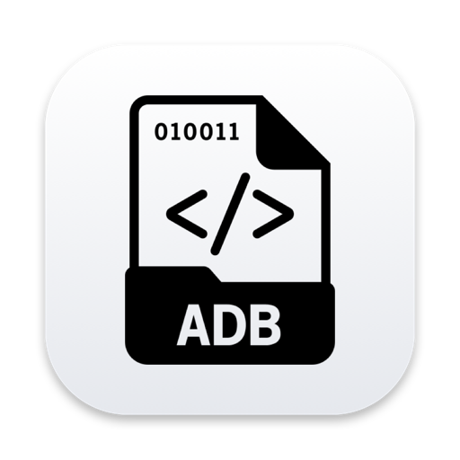
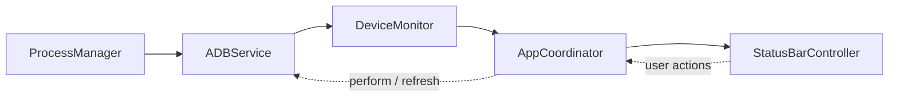

<div align="center">



# ADB Monitor

**Monitor Android devices connected over ADB from the macOS menu bar.**

</div>

ADB Monitor is a macOS menu bar app (pure AppKit, no Dock icon). It runs `adb devices -l` on a timer and shows the result in real time: how many devices are connected, their models, and their connection states. From the same menu you can copy a device serial, restart a device, or shut it down.

- [Features](#features)
- [Requirements](#requirements)
- [Installation](#installation)
- [Usage](#usage)
- [Preferences](#preferences)
- [Device states](#device-states)
- [Error handling](#error-handling)
- [Architecture](#architecture)
- [Development](#development)
- [Troubleshooting](#troubleshooting)
- [Limitations](#limitations)
- [Privacy and security](#privacy-and-security)
- [License](#license)

## Features

- **Menu bar icon with a device count**, for example the ADB document icon followed by `2`.
- **Device list** with model name, serial, and connection state, marked with a colored dot (green, orange, red, gray).
- **Per-device detail submenu**: state, serial, connection type (USB, Wi-Fi, Emulator), model, product, device name, and transport ID.
- **Copy serial** with one click.
- **Restart and Shut Down** with a confirmation dialog. Commands go only to the selected device (`adb -s <serial>`).
- **Auto-refresh**: the menu updates when a device is plugged in or unplugged, even while the menu is open.
- **Error handling** for a missing ADB install, a bad custom path, `adb` errors, and `adb` timeouts.
- **Preferences**: custom ADB path and refresh interval (1–60 seconds, default 3).
- **Dark and light mode** supported automatically (the menu bar icon is a template image).
- **Lightweight**: polls never overlap, no `adb` processes are left behind, and the code passes Swift 6 strict concurrency checking.

## Requirements

| Requirement | Details |
|---|---|
| macOS | 12.0 (Monterey) or later |
| ADB | `adb` from Android platform-tools, installed on your machine |
| Xcode | Needed to build from source. The project was created with Xcode 27 (project format `objectVersion 110`) |
| Android device | USB debugging enabled. On the first connection, allow this computer on the device |

Install ADB with Homebrew:

```sh
brew install --cask android-platform-tools
```

## Installation

There is no binary release yet. Build from source:

```sh
git clone https://github.com/nasiosheva/ADB-Monitor.git
cd ADB-Monitor
git checkout development

xcodebuild -project ADBMonitor.xcodeproj \
           -scheme ADBMonitor \
           -configuration Release \
           -derivedDataPath build \
           build

open build/Build/Products/Release/ADBMonitor.app
```

Or open `ADBMonitor.xcodeproj` in Xcode and press **⌘R**.

To use it like a normal app, copy `ADBMonitor.app` to `/Applications`. To start it at login, add it under **System Settings → General → Login Items**. There is no built-in "launch at login" option.

> **Note:** the app is signed with "Sign to Run Locally" (ad hoc) and is not notarized. On another Mac, Gatekeeper will warn. Open it with right-click → **Open**.

## Usage

After launch, the icon appears in the menu bar with the number of connected devices. Click it to open the menu:

```
Android Devices (2)
─────────────────────────────
● Pixel 3a (94GAY0NRYY) — Connected      ▸
● SM A107F (R9CN4057BXJ) — Connected     ▸
─────────────────────────────
Refresh                              ⌘R
Preferences…                         ⌘,
─────────────────────────────
Quit ADB Monitor                     ⌘Q
```

Hover over a device to open its submenu:

```
Status: Connected
Serial: 94GAY0NRYY
Connection: USB
Model: Pixel 3a
Product: sargo
Device: sargo
Transport ID: 2
─────────────────────────────
Copy Serial Number
Restart Device…
Shut Down Device…
```

### Restart and Shut Down

Both actions always ask for confirmation before they run.

| Action | Command | Available for |
|---|---|---|
| Restart | `adb -s <serial> reboot` | Connected, Recovery |
| Shut Down | `adb -s <serial> shell reboot -p` | Connected |

A menu item is grayed out when the action is not available for the device's current state. After a shutdown, the device **cannot be powered back on from the Mac**. Some vendors and ROMs reject the shell power-off command (`reboot -p`). If it fails, the error message from `adb` is shown in a dialog.

### Keyboard shortcuts

These work while the menu is open.

| Shortcut | Action |
|---|---|
| ⌘R | Refresh now |
| ⌘, | Open Preferences |
| ⌘Q | Quit |

## Preferences

Open it from **Preferences…** in the menu (⌘,).

| Setting | Details |
|---|---|
| **ADB path** | Leave empty for auto-detection. Set it to use a specific binary. **Choose…** opens a file picker. The label under the field shows the path that will be used, or an error message. |
| **Refresh interval** | Delay between polls, 1–60 seconds (default 3). |

Changes take effect right after **Save**: the app refreshes immediately with the new settings.

### ADB auto-detection order

GUI apps do not inherit the `PATH` from your shell, so `adb` is searched for in several places, in this order:

1. Every directory in the process `PATH`
2. `/opt/homebrew/bin/adb`, `/usr/local/bin/adb`, `/usr/bin/adb`
3. `$ANDROID_HOME/platform-tools/adb` and `$ANDROID_SDK_ROOT/platform-tools/adb`
4. `~/Library/Android/sdk/platform-tools/adb`

If you set a custom **ADB path** and it is invalid, the app does **not** silently fall back to auto-detection. The menu shows "ADB not found at custom path" so the mistake is visible.

Settings are stored in `UserDefaults` (keys `adbPath` and `refreshInterval`).

## Device states

| Dot | ADB state | Meaning |
|---|---|---|
| 🟢 | `device` | Connected normally |
| 🟠 | `unauthorized`, `no permissions`, `authorizing`, `connecting` | Needs action, or still connecting |
| 🔴 | `offline` | Listed but not responding |
| ⚪ | `recovery`, `sideload`, `bootloader`, others | Special mode |

Some states show a hint in the submenu, for example "Accept the USB debugging prompt on the device." for `unauthorized`.

The connection type is derived from the serial: `emulator-*` is Emulator, a serial that contains `:` or `._adb-tls-` is Wi-Fi, and anything else is USB when a USB path is present.

## Error handling

The icon changes to a warning symbol with the text `ADB`, and the menu explains the problem:

| Situation | What is shown |
|---|---|
| ADB not found | "ADB is not installed" with install instructions |
| Bad custom path | "ADB not found at custom path" and the path |
| `adb` exits with an error | The first line of `stderr`, or the exit code if `stderr` is empty |
| `adb` does not respond | "adb did not respond (timed out)" (10-second limit for the device list, 15 seconds for restart and shut down) |

After the problem is fixed (for example, you install ADB), the menu recovers on the next poll.

## Architecture

The app follows SOLID principles with manual dependency injection. Collaborators are small protocols, and only `AppDelegate` (the composition root) knows the concrete types.



### Folder structure

```
ADBMonitor/
├── App/            AppDelegate (entry point + composition root), AppCoordinator, MainMenuBuilder
├── Models/         ADBDevice, ADBStatus, ADBError, PowerAction
├── Services/       ADBService, ADBLocator, DeviceListParser, DeviceMonitor, Scheduler
├── Preferences/    Preference protocols, UserDefaultsPreferences
├── UI/             StatusBarController, StatusMenuBuilder, StatusButtonPresenter,
│                   AlertPresenter, PreferencesWindowController, DeviceStateStyle
├── Utils/          ProcessManager (+ ProcessSupport), UncheckedSendable, Foundation helpers
└── Assets.xcassets/  AppIcon, MenuBarIcon
```

| Component | Responsibility |
|---|---|
| `ProcessManager` | Runs commands on a background queue with a timeout. Pipes are read asynchronously so large output cannot deadlock |
| `ADBService` | ADB command facade: locates the binary, runs the command, translates the result into domain models |
| `DeviceListParser` | Parses the output of `adb devices -l` |
| `DeviceMonitor` | Polls on a timer and reports status changes |
| `AppCoordinator` | Wires the monitor, the status bar, and user actions together |
| `StatusBarController` / `StatusMenuBuilder` | Own the `NSStatusItem` and build the `NSMenu` dropdown |

### Key design decisions

- **Polls never overlap.** `DeviceMonitor` schedules the next poll *after* the current one finishes, using a single-shot timer instead of a fixed interval. A manual refresh during a poll only flags one extra round.
- **The timer keeps running while the menu is open.** The timer is registered in the `.common` run loop mode, so the device list keeps updating while the menu is displayed.
- **Only changes update the UI.** `onStatusChange` fires only when the status differs from the previous poll, so the menu does not flicker.
- **The menu is refilled in place.** The same `NSMenu` is emptied and filled again instead of being replaced, so an open menu does not close.
- **No hanging `adb` processes.** After the process exits, the app waits for pipe EOF for at most 1 second, with one shared deadline for stdout and stderr, because `adb` can leave a daemon child that still holds the pipe.
- **No retain cycles.** Closures capture `weak` references, and `Process` and the pipe collectors are created per run and released afterwards.
- **Explicit concurrency isolation.** UI code, `DeviceMonitor`, and `AppCoordinator` are `@MainActor`. Cross-thread code (`ProcessManager`) is `@unchecked Sendable`, with the reason in a comment. The result is clean under `-strict-concurrency=complete` (Swift 5) and under the Swift 6 language mode.
- **Explicit entry point.** `AppDelegate` is `@main` and defines its own `static func main()`. `@main` alone only calls `NSApplicationMain`, which creates the delegate only when a nib exists, and this project has no nib.

### Adding a new power action

`PowerAction` is `CaseIterable`. The menu items, the confirmation dialog, the adb arguments, and per-state availability are all derived from it. Adding an action (for example reboot to recovery) means adding one `case`. `StatusMenuBuilder` and `AlertPresenter` do not change.

## Development

### Build

```sh
xcodebuild -project ADBMonitor.xcodeproj -scheme ADBMonitor -configuration Debug build
```

The project uses `PBXFileSystemSynchronizedRootGroup`, so new Swift files under `ADBMonitor/` join the target automatically, without editing `project.pbxproj`.

### Build settings to know about

| Setting | Value | Reason |
|---|---|---|
| `MACOSX_DEPLOYMENT_TARGET` | `12.0` | Xcode 27 no longer supports targets below 12.0 |
| `ENABLE_APP_SANDBOX` | `NO` | The sandbox blocks launching `adb`. As a result the app cannot ship through the Mac App Store |
| `INFOPLIST_KEY_LSUIElement` | `YES` | Menu bar app with no Dock icon |
| `SWIFT_VERSION` | `5.0` | The code is also checked to compile as Swift 6 |

### Testing

There is no test target in the Xcode project yet. However, everything in `Models/`, `Services/`, `Preferences/`, and `Utils/` is free of AppKit, and all dependencies are protocols (`ProcessRunning`, `ADBLocating`, `DeviceListParsing`, `ADBServicing`, `Scheduling`, and so on). This makes the logic easy to test with fakes, without a real device. For example, `DeviceMonitor` can be tested with a fake `Scheduling` that you fire by hand.

`DeviceMonitor` is `@MainActor`. In a `swiftc`-based test harness, wrap its use in `MainActor.assumeIsolated { ... }`.

### Lint and concurrency checks

Code style: 4-space indentation, 120-column limit. Also run the compiler in strict mode. Both commands must be clean:

```sh
cd ADBMonitor && SDK=$(xcrun --show-sdk-path)
FILES="App/*.swift Models/*.swift Services/*.swift Preferences/*.swift UI/*.swift Utils/*.swift"

swiftc -typecheck -parse-as-library -sdk $SDK -target arm64-apple-macos12.0 \
       -swift-version 5 -strict-concurrency=complete $FILES
swiftc -typecheck -parse-as-library -sdk $SDK -target arm64-apple-macos12.0 \
       -swift-version 6 $FILES
```

`xcrun swift-format lint --recursive .` can also be used. Its `Indentation` and `AddLines` findings are intentionally ignored, because the code aligns multi-line parameter lists Xcode-style.

### `adb` output formats handled by the parser

Different `adb` versions print slightly different output, and the parser handles both:

```
R58M123ABC     device usb:1-1 product:o1sxxx model:SM_G991B device:o1s transport_id:2
R9CN4057BXJ    device 2-1 product:a10sxx model:SM_A107F device:a10s transport_id:1
0123456789     no permissions (user in plugdev group; are your udev rules wrong?); see [url]
```

The USB path can be `usb:1-1` or a bare `2-1`, and the state `no permissions` is two words. Daemon message lines (starting with `*`) are ignored.

## Troubleshooting

**The icon does not appear in the menu bar.**
When the menu bar is full, macOS can hide the leftmost items. Quit other menu bar apps or free up space. Also make sure only one instance is running.

**The menu says "ADB is not installed" but it is installed.**
GUI apps do not read the `PATH` from `~/.zshrc`. Find the location with `which adb`, then enter that path in **Preferences → ADB path**.

**A device shows as Unauthorized.**
Look at the device screen and accept the "Allow USB debugging" prompt. If it does not appear, unplug and replug the cable, or on the device choose *Revoke USB debugging authorizations* and try again.

**A device shows as Offline.**
Replug the device, or restart the adb server with `adb kill-server && adb start-server`.

**The message "adb server version doesn't match this client".**
Two different `adb` versions are running at the same time. Run `adb kill-server`, then make sure the app uses the same `adb` you use in the terminal (set it in Preferences).

**Restart works but Shut Down fails.**
Some vendors and ROMs reject `reboot -p` from the shell without root. The error is shown in a dialog. Power the device off manually.

**A wireless device is not detected.**
Connect it in the terminal first, for example `adb connect 192.168.1.5:5555` or `adb pair`. ADB Monitor shows what `adb devices -l` reports. It does not make connections itself.

## Limitations

- No binary release, notarization, or auto-update yet.
- Cannot be distributed through the Mac App Store because App Sandbox is turned off.
- No built-in "launch at login" option.
- No notification when a device connects or disconnects. Only the icon and the menu update.
- Only Restart and Shut Down. Reboot to recovery or bootloader is not implemented (easy to add, see [Adding a new power action](#adding-a-new-power-action)).
- No test target in the Xcode project yet.
- The UI is English only (not localized).

## Privacy and security

- The app makes no network connections of its own and sends no telemetry. The only thing it does is run the local `adb`.
- Settings are stored locally in `UserDefaults`.
- Because the app is not sandboxed, it can run any binary you point it to in **ADB path**. Only enter an `adb` you trust.
- Restart and Shut Down send commands to real devices. Both always ask for confirmation first.

## License

Not decided yet. Until a license file is added, all rights are held by the author.
